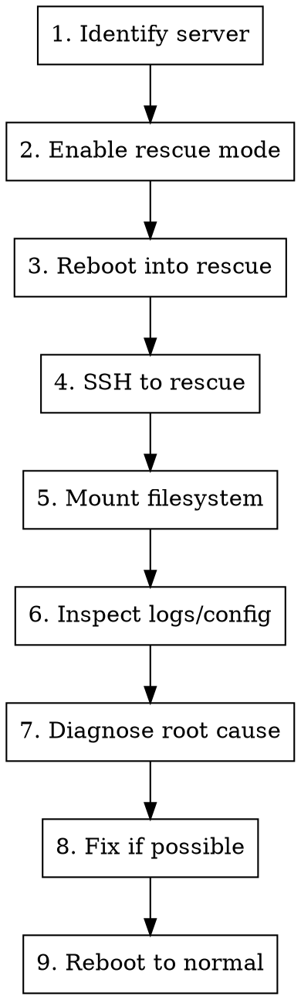

# Debug Hetzner Node via Rescue Console

## Overview

When a Hetzner Cloud server is unreachable (SSH hangs, provisioning stuck, cloud-init failure), this skill uses Hetzner's **rescue mode** to mount the node's filesystem and inspect everything from the outside — no working SSH required.

This is the nuclear option for debugging: it gives you root access to the node's disk even when the OS is completely broken.

## Usage

```
/debug-node
```

When invoked, ask for:
1. The server name or IP (can be found from `hcloud server list`)
2. What symptom they're seeing (SSH timeout, provisioning hang, etc.)

## Prerequisites

- `hcloud` CLI installed and configured with a valid token
- The server must exist in Hetzner Cloud
- An SSH key that Hetzner knows about (for rescue mode access)

```bash
# Verify hcloud CLI works
hcloud server list
```

## Workflow



## Step 1: Identify the Server

```bash
# List all servers
hcloud server list

# Or find by name pattern
hcloud server list -o columns=id,name,status,ipv4 | grep <pattern>
```

Note the server ID and IPv4 address.

## Step 2: Enable Rescue Mode & Reboot

```bash
# Enable rescue mode (returns a root password for rescue SSH)
hcloud server enable-rescue <SERVER_ID>

# Reboot the server into rescue
hcloud server reboot <SERVER_ID>

# Wait ~30 seconds for rescue to boot
sleep 30
```

**Important:** The rescue root password is shown in the `enable-rescue` output. You may need it if key auth doesn't work in rescue, but typically Hetzner rescue accepts your project SSH keys automatically.

## Step 3: SSH into Rescue

```bash
# Connect to rescue mode
ssh -o StrictHostKeyChecking=no -o UserKnownHostsFile=/dev/null root@<SERVER_IP>
```

You're now in a minimal Linux rescue environment with the server's disk available as `/dev/sda`.

## Step 4: Mount the Filesystem

### For MicroOS / Leap Micro (btrfs with subvolumes)

These distros use btrfs with transactional-update snapshots. The layout is:

```
/dev/sda2 (or sda3)  →  btrfs root
  @/                  →  base subvolume
  @/.snapshots/       →  snapshot container
  @/.snapshots/N/snapshot/  →  active snapshot (where /etc lives)
  @/root/             →  /root home
  @/var/              →  /var
```

```bash
# Find the btrfs partition
lsblk -f

# Mount the btrfs root
mkdir -p /mnt/root
mount /dev/sda2 /mnt/root       # or sda3, check lsblk output

# List subvolumes to find the active snapshot
btrfs subvolume list /mnt/root

# The active snapshot is usually the highest-numbered one
# Mount the active snapshot (adjust N to your snapshot number)
mkdir -p /mnt/snap
mount -o subvol=@/.snapshots/N/snapshot /dev/sda2 /mnt/snap

# Mount additional subvolumes
mount -o subvol=@/root /dev/sda2 /mnt/snap/root
mount -o subvol=@/var /dev/sda2 /mnt/snap/var

# Now /mnt/snap has the full filesystem view
```

### For Ubuntu / Debian (ext4)

```bash
mkdir -p /mnt/root
mount /dev/sda1 /mnt/root    # adjust partition as needed
```

## Step 5: Inspect — The Diagnostic Checklist

Run through these checks systematically. Each reveals a different class of failure.

### 5a. SSH Keys (Are they injected?)

```bash
# Check authorized_keys
cat /mnt/snap/root/.ssh/authorized_keys

# Verify the key matches what you expect
# Compare with your local pubkey:
# cat ~/.ssh/id_ed25519.pub
```

**Expected:** Your SSH public key should be present.
**If missing:** Cloud-init failed to inject keys.

### 5b. Cloud-Init Status

```bash
# Cloud-init result
cat /mnt/snap/var/lib/cloud/data/result.json

# Cloud-init status
cat /mnt/snap/var/lib/cloud/data/status.json

# Cloud-init datasource
ls /mnt/snap/var/lib/cloud/instance/
cat /mnt/snap/var/lib/cloud/instance/datasource

# Full cloud-init log
cat /mnt/snap/var/log/cloud-init.log | tail -100

# Cloud-init output log
cat /mnt/snap/var/log/cloud-init-output.log | tail -100
```

**Expected:** `result.json` shows no errors, datasource is `DataSourceHetzner`.
**If errors:** Read the full log to identify which module failed.

### 5c. SSHD Configuration

```bash
# Main sshd config
cat /mnt/snap/etc/ssh/sshd_config | grep -E "^(PermitRootLogin|PubkeyAuthentication|PasswordAuthentication|UsePAM|AuthorizedKeysFile)"

# Drop-in configs (cloud-init often writes here)
ls /mnt/snap/etc/ssh/sshd_config.d/
cat /mnt/snap/etc/ssh/sshd_config.d/*.conf

# Host keys (must exist)
ls -la /mnt/snap/etc/ssh/ssh_host_*
```

**Expected:** `PermitRootLogin` is `yes` or `prohibit-password`, `PubkeyAuthentication yes`.
**If wrong:** Cloud-init or packer snapshot has bad sshd config.

### 5d. Account Status (The Sneaky One)

```bash
# Check if root account is locked
grep '^root:' /mnt/snap/etc/shadow

# Decode the password field:
#   root:*:...     = unlocked, no password (pubkey works)
#   root:!:...     = locked (pubkey BLOCKED with UsePAM yes)
#   root:!*:...    = locked (pubkey BLOCKED with UsePAM yes)
#   root::...      = empty password (dangerous)
#   root:$6$...:   = has a password hash
```

**This is the #1 sneaky failure on Leap Micro Default.** The image ships with `root:!*` (locked), which makes sshd reject pubkey auth when `UsePAM yes` is set — even though the keys are correctly in authorized_keys.

**Fix:** In the packer snapshot build, add:
```bash
usermod -p '*' root
```
This unlocks the account without setting a password.

### 5e. SSHD Journal Logs

```bash
# If systemd journal is on the var subvolume
journalctl --root=/mnt/snap -u sshd --no-pager | tail -50

# Or check the binary journal directly
ls /mnt/snap/var/log/journal/
```

**Look for:** `User root not allowed because account is locked` — confirms the locked account issue.

### 5f. Network Configuration

```bash
# NetworkManager connections
ls /mnt/snap/etc/NetworkManager/system-connections/
cat /mnt/snap/etc/NetworkManager/system-connections/*.nmconnection

# Network interfaces
cat /mnt/snap/etc/sysconfig/network/ifcfg-* 2>/dev/null

# Firewall rules (if iptables/nftables persisted)
cat /mnt/snap/etc/nftables.conf 2>/dev/null
```

### 5g. Kubernetes State (if applicable)

```bash
# k3s config
cat /mnt/snap/etc/rancher/k3s/config.yaml 2>/dev/null

# k3s token
cat /mnt/snap/var/lib/rancher/k3s/server/token 2>/dev/null

# rke2 config
cat /mnt/snap/etc/rancher/rke2/config.yaml 2>/dev/null

# Service status (from journal)
journalctl --root=/mnt/snap -u k3s --no-pager | tail -30
journalctl --root=/mnt/snap -u rke2-server --no-pager | tail -30
journalctl --root=/mnt/snap -u rke2-agent --no-pager | tail -30
```

### 5h. SELinux State

```bash
# SELinux config
cat /mnt/snap/etc/selinux/config

# Check if SELinux packages are installed
chroot /mnt/snap rpm -qa | grep -i selinux

# Audit log for denials
cat /mnt/snap/var/log/audit/audit.log | grep denied | tail -20
```

## Step 6: Apply a Fix (If Possible)

Some fixes can be applied directly from rescue mode:

```bash
# Unlock root account
chroot /mnt/snap usermod -p '*' root

# Fix authorized_keys
mkdir -p /mnt/snap/root/.ssh
echo "ssh-ed25519 AAAA... your-key" > /mnt/snap/root/.ssh/authorized_keys
chmod 700 /mnt/snap/root/.ssh
chmod 600 /mnt/snap/root/.ssh/authorized_keys

# Fix sshd config
sed -i 's/^PermitRootLogin no/PermitRootLogin yes/' /mnt/snap/etc/ssh/sshd_config

# Regenerate host keys (if they were wiped)
chroot /mnt/snap ssh-keygen -A
```

## Step 7: Reboot to Normal

```bash
# Unmount everything
umount /mnt/snap/var /mnt/snap/root /mnt/snap /mnt/root 2>/dev/null

# Exit rescue SSH
exit
```

```bash
# Disable rescue mode and reboot to normal OS
hcloud server disable-rescue <SERVER_ID>
hcloud server reboot <SERVER_ID>

# Wait and test SSH
sleep 60
ssh -o StrictHostKeyChecking=no root@<SERVER_IP> 'echo "SSH works!"'
```

## Common Diagnoses

| Symptom | Likely Cause | Check | Fix |
|---------|-------------|-------|-----|
| SSH "Too many auth failures" | Root account locked | `/etc/shadow` shows `!*` | `usermod -p '*' root` in packer |
| SSH timeout | Firewall blocking | Check Hetzner firewall rules | Open port 22 to your IP |
| SSH "Connection refused" | sshd not running | Journal shows sshd crash | Check sshd config syntax |
| SSH key rejected | Keys not injected | `authorized_keys` empty | Check cloud-init logs |
| Provisioner hangs at "Still creating" | SSH can't connect | All of the above | Fix the SSH issue |
| Cloud-init errors | Datasource issue | `result.json` / logs | Check userdata encoding |
| k3s not starting | Config error | k3s journal logs | Fix config.yaml |
| SELinux denials | Policy issue | audit.log | Check selinux packages |

## Btrfs Subvolume Quick Reference

MicroOS and Leap Micro use this btrfs layout:

```
@                          → base (usually empty overlay)
@/.snapshots               → snapshot metadata
@/.snapshots/1/snapshot    → initial snapshot (pre-transactional-update)
@/.snapshots/2/snapshot    → after first transactional-update
@/.snapshots/N/snapshot    → latest active snapshot ← THIS IS YOUR /etc
@/root                     → /root home directory
@/var                      → /var (logs, lib, etc.)
@/srv                      → /srv
@/opt                      → /opt
@/boot/grub2/x86_64-efi   → GRUB modules
```

**Key insight:** `/etc` lives inside the active snapshot subvolume, NOT in the `@` base. Always mount the highest-numbered snapshot to see the current system state.

## Pro Tips

1. **Always check shadow FIRST** — it's the most common sneaky failure on immutable distros
2. **Mount the right snapshot** — `btrfs subvolume list` and pick the highest number
3. **Journal is gold** — `journalctl --root=` gives you sshd/systemd logs without a running system
4. **Don't forget var** — mount `@/var` separately or you'll miss logs
5. **chroot works** — you can `chroot /mnt/snap` to run commands as if you're on the live system
6. **Rescue mode is non-destructive** — the disk is untouched, you're just reading/writing files
