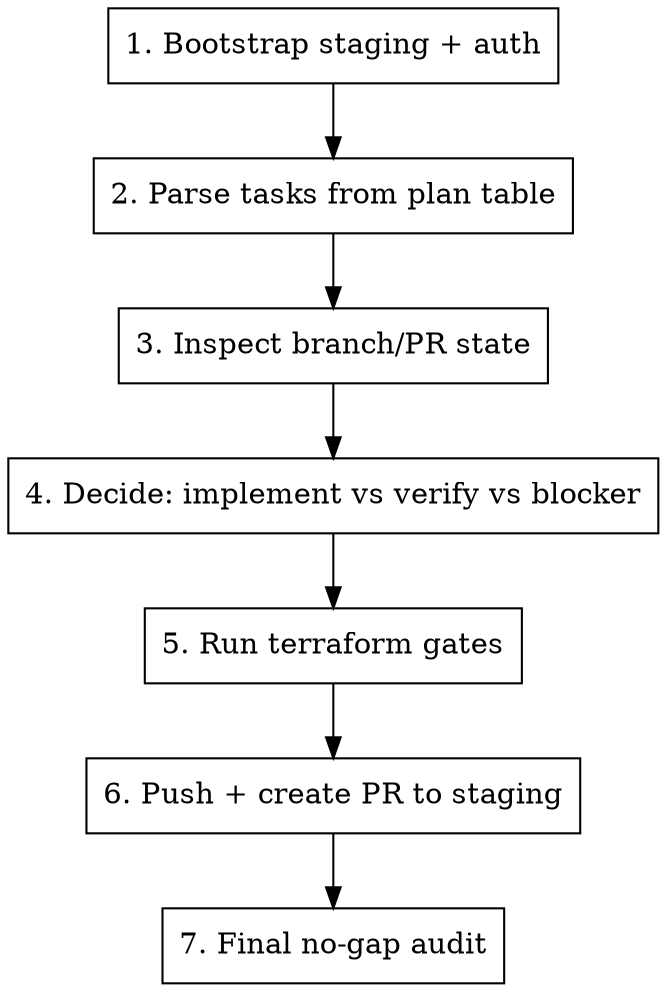

# Execute Hard Plan

## Overview

Run a large backlog plan end-to-end with strict project rules:
- base branch is `staging`
- always `git pull origin staging` before work
- one discussion/task = one branch + one PR targeting `staging`
- run terraform validation gates for each task branch before PR
- when switching branches, rewarm `colgrep` and `tldr`
- track blockers explicitly with blocker-plan PRs instead of silent skips

## Usage

```bash
/execute-hard-plan tasks/ideas_v3/remaining_62_tasks_hard_plan.md
```

## Required Invariants

1. Work from `/Volumes/MysticalTech/Code/kube-hetzner`.
2. PR base is always `staging`.
3. Pull latest `staging` before starting and before each new branch series.
4. Rewarm tools after branch switch:
```bash
colgrep init . -y
tldr warm .
```
5. Validation gates before opening PR:
```bash
cd /Volumes/MysticalTech/Code/kube-hetzner
terraform fmt -recursive
terraform validate
cd /Users/karim/Code/kube-test
terraform init -upgrade
terraform plan
```
6. If `terraform plan` fails with expected token/credential error (e.g. invalid `HCLOUD_TOKEN`), record it in PR body.

## Model Policy

- Deep/non-obvious reasoning: use `gpt-5.3-codex`.
```bash
codex exec -m gpt-5.3-codex -s read-only -c model_reasoning_effort="xhigh" "Analyze risk and migration strategy for <task>."
```
- Fast triage/small checks: use `gpt-5.3-codex-sparks`.
```bash
codex exec -m gpt-5.3-codex-sparks -s read-only "Is discussion #<n> already implemented in origin/staging?"
```

## Workflow



## Step 1: Bootstrap

```bash
cd /Volumes/MysticalTech/Code/kube-hetzner
git checkout staging
git pull origin staging
git fetch origin staging
gh auth status
colgrep init . -y
tldr warm .
```

## Step 2: Parse Task Rows from Plan

Extract task id, discussion id, and planned branch from markdown table.

```bash
awk -F'|' '/^\| T[0-9]+ /{
  task=$2; gsub(/ /,"",task);
  disc=$4; gsub(/ /,"",disc);
  branch=$10; gsub(/`| /,"",branch);
  print task"\t"disc"\t"branch
}' tasks/ideas_v3/remaining_62_tasks_hard_plan.md > /tmp/hard_plan_tasks.tsv
```

## Step 3: Inspect Existing State

For each task branch, detect:
- branch missing / exists
- ahead/behind vs `origin/staging`
- existing PR against `staging`

```bash
while IFS=$'\t' read -r task disc branch; do
  pr_url="$(gh pr list --head "$branch" --base staging --state all --json url --jq '.[0].url // ""')"

  if [ -n "$pr_url" ]; then
    echo -e "$task\t$disc\t$branch\tPR_EXISTS\t$pr_url"
    continue
  fi

  if git show-ref --verify --quiet "refs/heads/$branch"; then
    ahead=$(git rev-list --count origin/staging.."$branch")
    behind=$(git rev-list --count "$branch"..origin/staging)
    echo -e "$task\t$disc\t$branch\tNO_PR\tahead=$ahead behind=$behind"
  else
    echo -e "$task\t$disc\t$branch\tNO_PR\tMISSING_BRANCH"
  fi
done < /tmp/hard_plan_tasks.tsv > /tmp/hard_plan_status.tsv
```

## Decision Matrix

| Condition | Action |
|---|---|
| PR exists | Skip task |
| Branch exists and `ahead>0` | Push + PR |
| Branch exists and `ahead=0` | Verify objective in code; if already done, create verification PR note |
| Branch missing and objective straightforward | Implement task on planned branch |
| Branch missing and high-risk / cross-cutting | Create blocker-plan PR with design + migration path |

## Step 4: Branch Execution Rules

For each task requiring action:

```bash
git checkout staging
git pull origin staging

# Existing planned branch
if git show-ref --verify --quiet "refs/heads/$branch"; then
  git checkout "$branch"
else
  git checkout -b "$branch"
fi

# Mandatory rewarm after branch switch
colgrep init . -y
tldr warm .
```

## Step 5: Implement / Verify / Blocker Artifact

### A) Implement
- Make minimal backward-compatible code changes.
- Keep one task scope per branch.

### B) Verification PR (objective already in `origin/staging`)
Create an evidence note:

```bash
mkdir -p docs/ideas_v3_verification
cat > "docs/ideas_v3_verification/${task}-${issue}-verification.md" <<EOF2
# ${task} / Discussion #${issue} Verification

Status: already implemented in origin/staging.

## Evidence
- <file:path + what proves objective>
- <file:path + what proves objective>

## Notes
No additional code changes required.
EOF2
```

### C) Blocker PR (cannot safely implement now)
Create blocker-plan note:

```bash
mkdir -p docs/ideas_v3_verification
cat > "docs/ideas_v3_verification/${task}-${issue}-blocked.md" <<EOF2
# ${task} / Discussion #${issue} Blocker Note

Status: blocked pending design confirmation.

## Blocker
- <short reason>

## Detail
- <why risky / what can break>

## Proposed Next Implementation Steps
1. Finalize compatibility + migration strategy.
2. Implement minimal-safe changes behind backward-compatible defaults.
3. Validate upgrade path before merge.
EOF2
```

## Step 6: Validate Before PR

```bash
cd /Volumes/MysticalTech/Code/kube-hetzner
terraform fmt -recursive
terraform validate

cd /Users/karim/Code/kube-test
terraform init -upgrade
terraform plan
```

Record any expected environment error in PR body exactly.

## Step 7: Commit, Push, PR

```bash
cd /Volumes/MysticalTech/Code/kube-hetzner
git add <changed-files>
git commit -m "<type>: <task/discussion summary>"
git push -u origin "$branch"
```

PR body template:

```markdown
## Summary
- Implements backlog task TXX from discussion #NNNN.
- Branch: `codex/idea-...`

## Validation
- terraform fmt -recursive
- terraform validate
- terraform init -upgrade (in /Users/karim/Code/kube-test)
- terraform plan (in /Users/karim/Code/kube-test; <expected token/auth error if applicable>)
```

Create PR if missing:

```bash
gh pr create --base staging --head "$branch" --title "idea #NNNN: <short title>" --body "$(cat /tmp/pr_body.md)"
```

## Step 8: Final Completeness Audit

Assert no task in the plan is left without a PR.

```bash
missing=0
while IFS=$'\t' read -r task disc branch; do
  pr_url="$(gh pr list --head "$branch" --base staging --state all --json url --jq '.[0].url // ""')"
  if [ -z "$pr_url" ]; then
    echo "NO_PR $task $branch"
    missing=$((missing+1))
  fi
done < /tmp/hard_plan_tasks.tsv

echo "MISSING_PR_COUNT=$missing"
```

Goal state: `MISSING_PR_COUNT=0`.

## Optional: Produce Full Task→PR Map

```bash
while IFS=$'\t' read -r task disc branch; do
  pr_url="$(gh pr list --head "$branch" --base staging --state all --json url --jq '.[0].url // ""')"
  echo -e "$task\t$disc\t$branch\t$pr_url"
done < /tmp/hard_plan_tasks.tsv > /tmp/hard_plan_pr_map.tsv
```

## Common Failure Modes

1. Local `staging` diverges from `origin/staging`.
- Use `origin/staging` for ahead/behind checks.

2. Branch has no diff but task is listed.
- Verify objective is already implemented; create verification PR note.

3. High-risk architectural task cannot be safely merged quickly.
- Create blocker-plan PR instead of forcing a risky implementation.

4. PR body quoting fails in shell.
- Use heredoc file (`/tmp/pr_body.md`) then pass it to `gh pr create`.

## Completion Criteria

A hard-plan execution is complete only when:
- every task branch in the plan has a PR URL
- all PRs target `staging`
- each PR has validation evidence
- blocked items have explicit blocker-plan artifacts
- verification-only items have explicit evidence artifacts
