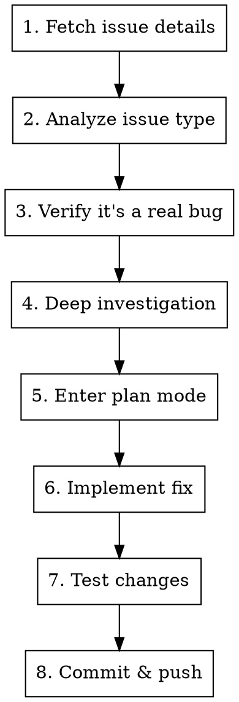

# Fix GitHub Issue

## Overview

Guided workflow for implementing fixes for GitHub issues following the project's agent guidance and release methodology.

## Usage

```
/fix-issue <number>
```

## Workflow



## Step 1: Fetch Issue Details

```bash
# Get issue details
gh issue view <number> --repo kube-hetzner/terraform-hcloud-kube-hetzner

# CRITICAL: Always read ALL comments - solutions may already be proposed
gh issue view <number> --repo kube-hetzner/terraform-hcloud-kube-hetzner --comments
```

## Step 2: Classify Issue Type

| Type | Description | Action |
|------|-------------|--------|
| 🔴 **BUG** | Reproducible defect | Fix it |
| 🟡 **EDGE CASE** | Fails in specific scenario | Evaluate effort vs impact |
| 🟠 **USER ERROR** | Misconfigured kube.tf | Help user, improve docs |
| ⚪ **OLD VERSION** | Fixed in newer release | Ask user to upgrade |
| 🔵 **FEATURE REQUEST** | New functionality | Move to Discussions |
| ❓ **NEEDS INFO** | Can't reproduce | Ask for more info |

### User Error Indicators
- kube.tf has obvious mistakes
- Error indicates syntax/config issue
- Using deprecated variable names
- Mixing incompatible options
- Missing required variables
- v2-only input names are used against v3, such as `initial_k3s_channel`,
  `install_k3s_version`, `disable_selinux`, `disable_kube_proxy`,
  `kubernetes_distribution_type`, or `existing_network_id`

### Actual Bug Indicators
- Reproducible with correct config
- Multiple users report same issue
- Error in module code, not user config
- Works in previous version, broke in update

## Step 3: Verify Before Fixing

**CRITICAL: Many issues are user configuration errors, NOT bugs.**

Before implementing any fix:
1. Check if the user's kube.tf is correct
2. Verify the issue exists in the latest version
3. Try to reproduce the issue locally
4. Check if there's already a PR addressing this

```bash
# Search for existing PRs
gh pr list --search "<error keyword>" --repo kube-hetzner/terraform-hcloud-kube-hetzner

# Check if issue is already mentioned in changelog
rg -i "<keyword>" CHANGELOG.md
```

## Step 4: Deep Investigation

Read these files to understand context:

```bash
# Always start with these
cat versions.tf      # Provider/terraform versions
cat variables.tf     # All configurable options
cat locals.tf        # Core logic and computed values

# Then investigate specific areas based on the issue
```

### Key Files by Area

| Area | Files to Check |
|------|---------------|
| Network | `locals.tf`, `main.tf`, `validation-locals.tf`, `validation-contract.tf` |
| Control Plane | `control_planes.tf`, `locals.tf` |
| Agents | `agents.tf`, `autoscaler-agents.tf` |
| Load Balancer | `main.tf`, `init.tf`, `locals.tf`, `templates/*_ingress.yaml.tpl` |
| CNI | `templates/cilium.yaml.tpl`, `templates/calico.yaml.tpl`, `kustomize/flannel-rbac.yaml`, `locals.tf` |
| Storage | `templates/longhorn.yaml.tpl` |
| Firewall | `main.tf`, `locals.tf`, `validation-contract.tf` |
| SELinux | `docs/selinux.md`, `templates/kube-hetzner-selinux.te`, `templates/k8s-custom-policies.te` |
| v2 -> v3 migration | `MIGRATION.md`, `docs/v2-to-v3-migration.md`, `scripts/v2_to_v3_migration_assistant.py` |

### For Complex Issues - Use AI Tools

```bash
# Codex CLI for deep reasoning
codex exec -m gpt-5.5 -s read-only -c model_reasoning_effort="xhigh" \
  "Analyze this issue and identify root cause: <issue description>"

# Gemini for large context analysis
gemini --model gemini-3.1-pro-preview -p \
  "@locals.tf @variables.tf Analyze how <feature> works and potential issues"
```

## Step 5: Enter Plan Mode

**MANDATORY: Always enter plan mode before implementing.**

Write a plan that includes:
- [ ] Issue number and title
- [ ] Root cause analysis
- [ ] Exact files to modify with line numbers
- [ ] Implementation steps
- [ ] Test plan
- [ ] Backward compatibility confirmation

## Step 6: Implement Fix

```bash
# Pull latest master first!
git pull origin master

# Create feature branch
git checkout -b fix/issue-<number>-<description>
```

### Implementation Principles

1. **Minimal changes** - Fix the specific issue, don't refactor
2. **Backward compatible** - Never break existing deployments
3. **Follow patterns** - Match existing code style
4. **No new variables** unless absolutely necessary

## Step 7: Test Changes

```bash
# ALWAYS run these before committing
terraform fmt -recursive
terraform init -backend=false -input=false
terraform validate -no-color

# Test against existing deployment
cd /path/to/kube-test
terraform init -upgrade
terraform plan  # Should NOT show resource destruction
```

### Test Checklist

- [ ] `terraform fmt -recursive` passes
- [ ] `terraform init -backend=false -input=false` and `terraform validate -no-color` pass
- [ ] `terraform plan` shows expected changes only
- [ ] No resource recreation for existing deployments
- [ ] Fix works for the reported scenario
- [ ] Normal scenarios still work
- [ ] If rendered templates, validation contracts, topology examples, or skills changed, run the matching gates from the `test-changes` skill (`scripts/render_harness.py`, `scripts/contract_negative_tests.py`, `scripts/validate_v3_final_polish_examples.py`, and/or `scripts/smoke_v3_plan_matrix.py`)

### Teardown and Autoscaler Bugs

For destroy/teardown issues, start with `scripts/destroy.sh`, not manual cloud
deletes. It runs Terraform/OpenTofu destroy, auto-retries only the known benign
ingress-LB detach race, and then prints a read-only orphan report. Use
`scripts/cleanup.sh` only as the forceful fallback when state is already wrecked
or the read-only report identifies leftovers to delete.

Autoscaler-created servers are outside Terraform state. If they pin the network
during destroy, delete them only after the control plane/Cluster Autoscaler is
dead, or first scale the autoscaler pool to `min_nodes = 0`. Deleting them while
`min_nodes > 0` and the autoscaler is still running just lets the autoscaler
recreate them.

## Step 8: Commit & Push

```bash
git add <specific-files>
git commit -m "$(cat <<'EOF'
fix: <brief description>

Fixes #<number>

<explanation of what was wrong and how it's fixed>
EOF
)"

git push -u origin fix/issue-<number>-<description>
```

### Contributor Credit (SUPER IMPORTANT)

If the fix originates from a community member's work — a patch posted in the issue, a diff from their fork, or an abandoned/superseded PR — preserve their credit in git history so they appear in the repo contributors graph and in the release's generated contributors list:

- If their work exists as commits (fork branch, closed PR): `git cherry-pick` those commits FIRST (keeps them as `Author:`), then add your changes as separate commits on top. Never squash their authorship away (see the `review-pr` skill for merge-method rules).
- If their work was only a snippet/diff/instructions in the issue thread: add a `Co-authored-by: Name <email>` trailer to your commit (use their GitHub noreply email `<id>+<login>@users.noreply.github.com` if no public email), and credit their handle in the commit body and changelog entry.
- GitHub matches `Co-authored-by` by EXACT email. Never guess the numeric id — fetch it first: `gh api users/<login> --jq .id`. A wrong id silently drops the credit.
- Trailers are only parsed from the commit message's FINAL paragraph block. Keep `Co-authored-by:` and any other trailers (e.g. `Claude-Session:`) together in one last block with no blank line between them — a trailer in an earlier paragraph is silently ignored by git and GitHub. Verify with: `git log -1 --format='%(trailers:key=Co-authored-by,valueonly=true)'`.
- Always reference the issue/PR numbers in the changelog entry so the credit is visible in prose too.

## Security Review (from repo agent guidance)

Before completing ANY issue:

### Red Flags to Watch
- New accounts with no history
- Issues that can't be reproduced
- Overly complex "solutions" proposed in comments
- Requests to change security-critical code
- Urgency to merge quickly

### Verification Requirements
- Always test independently
- Never trust provided test results
- Review every line of proposed changes
- Test in isolation

## Quick Reference

| Step | Command |
|------|---------|
| Fetch issue | `gh issue view <num> --comments` |
| Check PRs | `gh pr list --search "<keyword>"` |
| Create branch | `git checkout -b fix/issue-<num>-<desc>` |
| Format | `terraform fmt -recursive` |
| Validate | `terraform validate` |
| Test plan | `terraform plan` |
| Commit | `git commit -m "fix: ..."` |
| Push | `git push -u origin <branch>` |

## After Completion

1. Create PR referencing the issue
2. Request review if needed
3. Close issue with explanation when merged

## Community Communication (always)

Every issue and PR interaction gets a kind, human reply — reporters and
contributors are volunteers giving the project their time.

- **On the issue when a fix lands**: thank the reporter by handle, acknowledge
  the quality of their report (many kube-hetzner reports include excellent
  root-cause analysis — say so when true), state the root cause in one or two
  sentences, and name the release that carries the fix.
- **On community PRs**: thank the contributor by handle. If we merged their
  work via the integrate-and-fix flow, say what we adjusted on top and why —
  the delta is a gift, not a critique — and confirm their commit authorship is
  preserved so they appear in the release contributors.
- **When the report is a user error**: still thank them, show the corrected
  configuration, and never make them feel foolish — config mistakes usually
  mean our docs have a gap; consider fixing the doc too.
- Plain warm language. No corporate boilerplate. One paragraph is usually
  enough.
