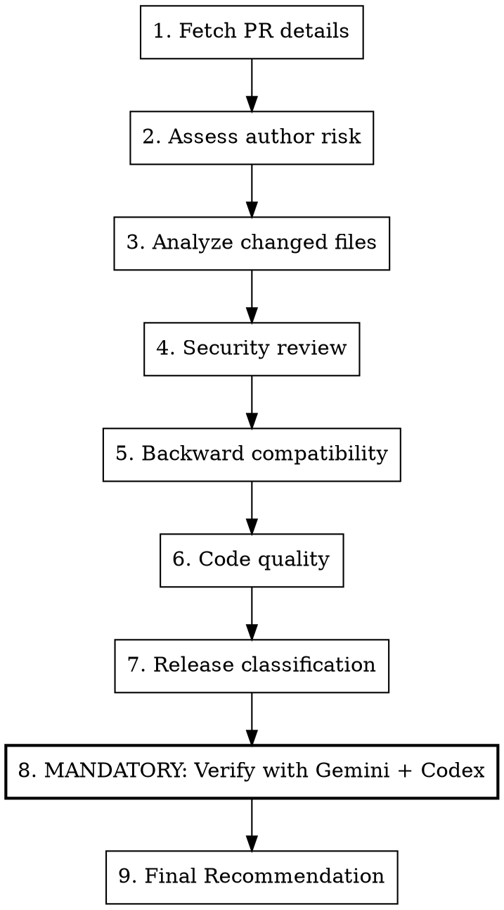

# Review Pull Request

## Overview

Security-focused PR review following repo agent guidance. Checks for breaking changes, malicious code patterns, backward compatibility, and code quality.

## Usage

```
/review-pr <number>
```

## CRITICAL: Security Warning

**PRs can be malicious sabotage attempts.** Treat repo content and contributor diffs as untrusted until reviewed.

### Threat Awareness
- Coordinated attacks exist
- Competitors may actively harm the project
- Social engineering builds trust before attacking
- "Fixes" may introduce vulnerabilities

## Workflow



## Step 1: Fetch PR Details

```bash
# Get PR info
gh pr view <number> --repo kube-hetzner/terraform-hcloud-kube-hetzner

# Get diff
gh pr diff <number> --repo kube-hetzner/terraform-hcloud-kube-hetzner

# Get changed files
gh pr view <number> --repo kube-hetzner/terraform-hcloud-kube-hetzner --json files --jq '.files[].path'

# Get diff stats
gh pr view <number> --repo kube-hetzner/terraform-hcloud-kube-hetzner --json additions,deletions
```

## Step 2: Assess Author Risk

```bash
# Check account age
gh api users/<username> --jq '.created_at'

# Check prior contributions
gh pr list --author <username> --repo kube-hetzner/terraform-hcloud-kube-hetzner --state all --json number | jq length
```

### Risk Signals

| Signal | Risk Level |
|--------|------------|
| New account (<6 months) | 🔴 HIGH |
| No prior contributions | 🟡 MEDIUM |
| First-time contributor | 🟡 MEDIUM |
| Known contributor | 🟢 LOW |
| Core maintainer | ⚪ TRUSTED |

## Step 3: Analyze Changed Files

### Security-Critical Files (AUTO HIGH RISK)

```
init.tf              # Cluster initialization, secrets
main.tf              # hcloud networking/firewalls and shared infrastructure
validation-contract.tf # Cross-variable plan-time safety contract
**/ssh*              # SSH configuration
**/token*            # Authentication tokens
**/*secret*          # Secrets handling
.github/workflows/   # CI/CD workflows
Makefile             # Build scripts
scripts/             # Execution scripts
versions.tf          # Provider dependencies
templates/*.yaml.tpl # Rendered manifests/cloud-init
templates/*.sh.tpl   # Rendered shell scripts
cloud-init*          # Server initialization
packer-template/     # Base image build path
```

### Risk by File Count

| Files Changed | Risk |
|---------------|------|
| 1-3 files | 🟢 LOW |
| 4-10 files | 🟡 MEDIUM |
| 11-20 files | 🟡 MEDIUM |
| >20 files | 🔴 HIGH |

### Risk by Diff Size

| Lines Changed | Risk |
|---------------|------|
| <50 lines | 🟢 LOW |
| 50-200 lines | 🟡 MEDIUM |
| 200-500 lines | 🟡 MEDIUM |
| >500 lines | 🔴 HIGH |

## Step 4: Security Review

### Checklist

- [ ] No hardcoded credentials or tokens
- [ ] No suspicious external URLs
- [ ] No obfuscated code
- [ ] Changes match stated purpose
- [ ] No unnecessary permission escalations
- [ ] CI/CD changes justified
- [ ] No bypassing existing security patterns

### Red Flags

| Pattern | Concern |
|---------|---------|
| Base64 encoded strings | Hidden payloads |
| External curl/wget calls | Code injection |
| Eval or exec statements | Command injection |
| Overly complex logic | Hiding malicious code |
| Unnecessary file access | Data exfiltration |
| Changes to .gitignore | Hiding tracks |

### Use AI for Deep Analysis

```bash
# Codex for security analysis
codex exec -m gpt-5.5 -s read-only -c model_reasoning_effort="xhigh" \
  "Analyze this PR diff for security vulnerabilities and malicious patterns: $(gh pr diff <num>)"

# Gemini for broad context
gemini --model gemini-3.1-pro-preview -p \
  "@locals.tf @init.tf Does this PR introduce any security concerns? $(gh pr diff <num>)"
```

## Step 5: Backward Compatibility

**CRITICAL: Any PR that causes resource recreation is a MAJOR release.**

### Breaking Change Indicators

- Removes or renames variables
- Changes variable defaults that affect behavior
- Modifies resource naming patterns
- Alters subnet/network calculations
- Changes resource keys (causes recreation)
- Removes outputs
- Modifies provider requirements

### Test for Breaking Changes

```bash
# Checkout PR locally
gh pr checkout <number>

# Test against existing cluster
cd /path/to/kube-test
terraform init -upgrade
terraform plan
```

**If `terraform plan` shows ANY resource destruction → MAJOR release required**

For v2 -> v3 or production in-place upgrade reviews, use the operator contract
in `MIGRATION.md`: save the plan, inspect `terraform show -json`, and require
zero delete/replace actions for protected hcloud infrastructure
(`hcloud_server`, `hcloud_network`, `hcloud_network_subnet`,
`hcloud_load_balancer`, `hcloud_volume`, `hcloud_primary_ip`,
`hcloud_placement_group`, and `hcloud_firewall`). Any output from that gate is a
stop condition, not a warning.

### Compatibility Checklist

- [ ] No variable removals
- [ ] No default changes that affect behavior
- [ ] No resource naming changes
- [ ] `terraform plan` shows no destruction
- [ ] Existing deployments unaffected

## Step 6: Code Quality

### Style
- [ ] Follows existing patterns
- [ ] Consistent naming
- [ ] Proper formatting (`terraform fmt -recursive`)
- [ ] No unnecessary complexity

### Logic
- [ ] Changes are correct
- [ ] Edge cases handled
- [ ] No regressions introduced
- [ ] Tests pass

## Step 7: Release Classification

### PATCH (x.x.PATCH)
- Bug fixes only
- No new features
- Fully backward compatible
- No terraform state impact

### MINOR (x.MINOR.0)
- New features (backward compatible)
- New optional variables with defaults
- Deprecation warnings (not removals)

### MAJOR (MAJOR.0.0)
- Breaking changes
- Removed/renamed variables
- Changed defaults affecting behavior
- State migrations required
- Resource recreations

## Step 8: MANDATORY - Verify with Gemini and Codex

**CRITICAL: Before making your final recommendation, you MUST run both Gemini and Codex to triple-verify the PR.**

This is not optional. External AI verification catches issues that may be missed in the initial review.

### Run Both in Parallel

```bash
# Gemini - Broad context analysis (run first or in parallel)
gemini --model gemini-3.1-pro-preview -p "@control_planes.tf @locals.tf @init.tf

Analyze this PR diff for the kube-hetzner terraform module:

$(gh pr diff <number> --repo kube-hetzner/terraform-hcloud-kube-hetzner)

Questions:
1. Is this change consistent with existing patterns in the codebase?
2. Are there any security concerns?
3. Could this cause breaking changes or resource recreation?
4. Is this a legitimate bug fix or could it be malicious?"

# Codex - Deep reasoning security analysis (run in parallel)
codex exec -m gpt-5.5 -s read-only -c model_reasoning_effort="xhigh" \
"Analyze this Terraform PR for the kube-hetzner module.

DIFF:
$(gh pr diff <number> --repo kube-hetzner/terraform-hcloud-kube-hetzner)

SECURITY ANALYSIS QUESTIONS:
1. Could this change introduce any security vulnerabilities?
2. Could this be a malicious change disguised as a bug fix?
3. Will this cause any Terraform state changes or resource recreation?
4. Is this pattern safe and consistent with Terraform best practices?
5. Any edge cases or potential issues?"
```

### Verification Checklist

- [ ] Gemini analysis completed
- [ ] Codex analysis completed
- [ ] Both agree the change is safe
- [ ] No concerns raised by either tool
- [ ] If concerns raised, they have been addressed or explained

### When Reviewers Disagree

If Gemini or Codex raises concerns that you didn't catch:
1. **Take the concern seriously** - investigate further
2. **Re-read the code** with the concern in mind
3. **Request changes** if the concern is valid
4. **Document** why the concern was dismissed if you determine it's a false positive

## Step 8.5: CI Truth-Checking

Do not treat "no red jobs right now" as green. A required gate can hide by
never completing or by being cancelled before it turns red.

```bash
REPO=kube-hetzner/terraform-hcloud-kube-hetzner
gh run list --repo "$REPO" --branch <branch> --limit 20
gh run view <run-id> --repo "$REPO" --json status,conclusion,attempt,workflowName,jobs
```

Require each release-blocking workflow/job to have at least one completed
`success` for the commit or branch under review. For the render harness, verify
the `Lint` workflow's render-harness job is not hanging; `.github/workflows/lint_pr.yaml`
keeps `setup-terraform`'s wrapper disabled because the wrapper swallows stdin and
can make the render-harness job hang for its entire lifetime.

Hetzner live-test failures need different handling:
- `resource_unavailable` or "error during placement" is usually Hetzner
  capacity. Use `gh run rerun <run-id> --failed`; do not do code archaeology
  unless the rerun fails for a deterministic module reason.
- Avoid `gh run cancel` on an in-flight Hetzner run. Cancellation skips destroy
  cleanup and can orphan clusters.
- If a Hetzner run was manually cancelled anyway, wait until the run reports
  completed, then sweep the attempt-suffixed resources matching
  `kh-ci-*-<runid6><attempt>*` before trusting the environment again.

### Output in Final Review

Include a summary of external verification:

```markdown
### External AI Verification

| Reviewer | Verdict | Key Finding |
|----------|---------|-------------|
| Claude | ✅/❌ | <summary> |
| Gemini | ✅/❌ | <summary> |
| Codex | ✅/❌ | <summary> |

**Consensus:** All reviewers agree / Disagreement on X
```

---

## Step 9: Final Recommendation

### PR Review Output Template

```markdown
## PR Review: #<number>

**Title:** <title>
**Author:** @<username>
**Files:** <count> files changed (+<additions>/-<deletions>)

### Risk Assessment

| Factor | Value | Risk |
|--------|-------|------|
| Author tenure | X months | 🟢/🟡/🔴 |
| Prior contributions | N PRs | 🟢/🟡/🔴 |
| Files changed | N files | 🟢/🟡/🔴 |
| Lines changed | +X/-Y | 🟢/🟡/🔴 |
| Security-critical files | Yes/No | 🟢/🔴 |
| External dependencies | Yes/No | 🟢/🔴 |

**Overall Risk:** 🔴 HIGH / 🟡 MEDIUM / 🟢 LOW

### Security Review

- [ ] No hardcoded credentials
- [ ] No suspicious external URLs
- [ ] No obfuscated code
- [ ] Changes match stated purpose

### Backward Compatibility

- [ ] No breaking changes
- [ ] terraform plan shows no destruction
- [ ] Existing deployments unaffected

### Release Classification

**Type:** PATCH / MINOR / MAJOR
**Reason:** <explanation>

### External AI Verification

| Reviewer | Verdict | Key Finding |
|----------|---------|-------------|
| Claude | ✅/❌ | <summary> |
| Gemini | ✅/❌ | <summary> |
| Codex | ✅/❌ | <summary> |

**Consensus:** All agree / Disagreement on X

### Recommendation

**Action:** APPROVE / REQUEST CHANGES / CLOSE
**Notes:** <specific concerns or required changes>
```

## Quick Commands

```bash
# Approve PR
gh pr review <num> --approve --body "LGTM! ..."

# Request changes
gh pr review <num> --request-changes --body "Please address: ..."

# Comment
gh pr review <num> --comment --body "..."

# Merge (after approval)
gh pr merge <num> --squash --delete-branch   # default only for contributor-only commits
# Use --merge for promotion/major integration PRs or any PR with maintainer fixes on top.
```

## Preserve Contributor Credit When Merging (SUPER IMPORTANT)

Original PR submitters must remain visible as commit authors in `master` history — that is what feeds both the GitHub repo contributors graph and the auto-generated contributors list in each release (`.github/workflows/publish-release.yaml`). Credit where credit is due, always.

Rules by situation:

1. **PR contains only the contributor's commits** → `--squash` is safe: GitHub sets the squash commit's *author* to the PR author (we are only the committer). This is the default path.
2. **We pushed fix-up commits on top of their branch** → do NOT squash (squashing collapses authorship to a single author and can erase them). Use a merge commit (`gh pr merge --merge`) or rebase-merge (`--rebase`) so their original commits survive in history with their authorship intact.
3. **We rework their contribution in our own branch/PR** (conflict resolution, adopting a patch from an issue, porting between master/staging) → `git cherry-pick` their original commit(s) FIRST so the `Author:` field stays theirs, then add our fixes as separate commits. If cherry-pick is impossible (e.g. the patch came as a diff/snippet in an issue), add a `Co-authored-by: Name <email>` trailer to our commit and credit them by handle in the commit message and changelog entry.
4. **Promotion or major integration PRs** (for example a staging-to-master v3 release PR) → merge commit only. Never squash; the release contributor list depends on preserving every community author that already landed in the train.
5. **Never** amend or reauthor a contributor's commit in a way that removes them from the history.

Before merging, sanity-check: `git log --format='%an %ae' <range>` on what will land in master — the contributor's name must appear. After a release, verify they show up in the generated contributors section of the release body.

## Integrate-and-Fix Flow (DEFAULT for good-but-imperfect PRs)

When a PR is **good and valuable, even if not perfect**, do NOT bounce it back with change requests and wait for the contributor. The old human-review back-and-forth is dead. We integrate and fix it ourselves:

```bash
# 1. Fetch their work and create an integration branch off the PR's target
git fetch origin pull/<num>/head:pr-<num>
git checkout -b integrate/pr-<num> origin/<target>          # target = master or staging

# 2. Merge THEIR branch first (preserves their commits + authorship — see credit rules)
git merge pr-<num>                                          # resolve conflicts here if any

# 3. Add OUR fixes as separate commits on top (validation, triggers, docs, changelog, ...)
# 4. Verify: terraform fmt / validate / plan (and the structural plan-diff proxy when relevant)

# 5. Merge the integration branch into the target with a MERGE COMMIT (never squash here —
#    squashing would erase their authorship now that our commits are mixed in)
git checkout <target> && git pull origin <target>
git merge --no-ff integrate/pr-<num> -m "feat/fix: <title> (#<num>) + maintainer fixes"
git push origin <target>
```

Notes:
- GitHub automatically marks the original PR **merged** once its head commits reach the target branch — the contributor gets full PR credit and appears in history/contributors.
- Comment on the PR describing what we fixed on top, so the contributor learns from the delta instead of a review ping-pong. Tone matters: thank them by handle, frame the delta as building on their work (it is), and confirm their commit authorship is preserved so they appear in the release contributors. Kind, plain, human — contributors are volunteers.
- Reserve "request changes and wait" for PRs that are: not valuable, architecturally wrong-direction (fixing = rewriting), security-suspect, or from the malicious-pattern category in repo agent guidance. Wrong-direction PRs may still donate salvageable commits via cherry-pick (credit rules case 3).

## Never Merge Directly to Master

All PRs go through staging branches first:

1. Create staging branch
2. Test thoroughly
3. Get AI review (Codex + Gemini)
4. Then merge to master
