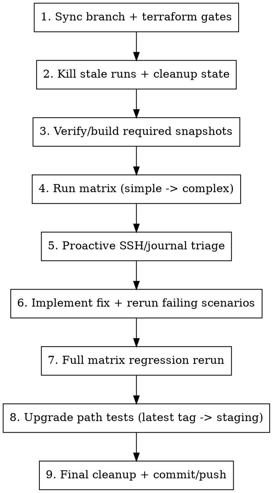

# Running Stabilization Loop

## Overview

Use this workflow when the goal is not only to detect failures, but to fix them and prove full regression safety after major changes.

## Usage

```bash
/running-stabilization-loop
```

## Buddy Prompt Template

Use this exact prompt when delegating the loop to another agent:

```text
Run the full kube-hetzner v3 stabilization loop end-to-end, do not stop at pass/fail reporting.

Goals:
1) Make every matrix scenario pass from simple to complex.
2) Fix root causes in kube-hetzner (not workarounds in test harness) unless explicitly required.
3) Re-run full matrix after fixes to prove no regressions.
4) Validate upgrade path from latest git tag to current staging for both k3s and rke2.

Hard requirements:
- Use /Users/karim/.ssh/id_ed25519 with IdentitiesOnly=yes for all SSH.
- Use /Volumes/MysticalTech/Code/kube-test/run_v3_matrix.sh and summary-*.md as source of truth.
- If RKE2/K3s apply hangs, SSH during apply and inspect journalctl/cloud-init immediately.
- If destroy hangs, run cleanup and delete stuck autoscaled servers via hcloud.
- Keep changes minimal and production-safe; run terraform fmt/validate before each rerun.

Deliverables:
- Final scenario matrix results with log paths.
- List of fixes made with files changed.
- Upgrade test result (tag -> staging) and any required migration notes.
- Confirmation cleanup is complete and no khv3-* resources are left.
```

## Test Environment

- Module code: `/Volumes/MysticalTech/Code/kube-hetzner`
- Test harness: `/Volumes/MysticalTech/Code/kube-test`
- Matrix runner: `/Volumes/MysticalTech/Code/kube-test/run_v3_matrix.sh`
- SSH key (required): `/Users/karim/.ssh/id_ed25519`

## Invariants

1. Always use `-o IdentitiesOnly=yes -i /Users/karim/.ssh/id_ed25519` for SSH.
2. Always start from a clean scenario state before new loops.
3. If any matrix scenario fails, debug and fix it before continuing.
4. After targeted fixes, rerun the full matrix to guard against regressions.
5. For destroy hangs with autoscaler/LB leftovers, use cleanup and `hcloud` deletes.
6. Do not keep temporary broad firewall overrides after root cause is fixed.
7. Treat `scenarios_v3/summary-*.md` + scenario `logs/*.log` as canonical run evidence.

## Workflow



## Step 1: Sync Branch and Run Gates

```bash
cd /Volumes/MysticalTech/Code/kube-hetzner
git checkout staging
git pull --ff-only origin staging
terraform fmt -recursive
terraform validate

cd /Volumes/MysticalTech/Code/kube-test
terraform init -upgrade
```

## Step 2: Kill Stale Runs and Clean State

```bash
pkill -f run_v3_matrix.sh || true
pkill -f "terraform -chdir=/Volumes/MysticalTech/Code/kube-test/scenarios_v3" || true
```

Destroy all scenarios:

```bash
for d in \
  s1-k3s-basic \
  s2-rke2-basic \
  s3-k3s-autoscaler \
  s4-rke2-autoscaler \
  s5-leapmultiarch \
  s6-mixed-os \
  s7-kubeapi-join-lb
do
  terraform -chdir="/Volumes/MysticalTech/Code/kube-test/scenarios_v3/$d" destroy -auto-approve || true
done
find /Volumes/MysticalTech/Code/kube-test/scenarios_v3 -name ".terraform.tfstate.lock.info" -delete
```

If resources are stuck (especially autoscaler nodes), run:

```bash
cd /Volumes/MysticalTech/Code/kube-test
/Volumes/MysticalTech/Code/kube-hetzner/scripts/cleanup.sh
```

Optional alias:

```bash
alias cleanupkh='/Volumes/MysticalTech/Code/kube-hetzner/scripts/cleanup.sh'
```

And if autoscaled servers still exist, delete directly:

```bash
ids="$(hcloud server list -o columns=id,name | awk '/khv3-/{print $1}')"
if [ -n "$ids" ]; then
  echo "$ids" | xargs -n1 hcloud server delete
fi
```

## Step 3: Verify Snapshot Prerequisites

Expected snapshots:
- Leap Micro: `k3s x86`, `k3s arm`, `rke2 x86`, `rke2 arm` (4 total)
- MicroOS: x86 + arm (2 total, optional but recommended for mixed-os scenarios)

Check:

```bash
hcloud image list --type snapshot -o columns=id,name,architecture,labels
```

Create missing ones from kube-test:

```bash
cd /Volumes/MysticalTech/Code/kube-test
export HCLOUD_TOKEN="$(awk -F'\"' '/hcloud_token/{print $2}' terraform.tfvars)"

packer init hcloud-leapmicro-snapshots.pkr.hcl
for distro in k3s rke2; do
  packer build -var "selinux_package_to_install=${distro}" hcloud-leapmicro-snapshots.pkr.hcl
done

packer init hcloud-microos-snapshots.pkr.hcl
packer build hcloud-microos-snapshots.pkr.hcl
```

## Step 4: Run Matrix (Simple to Complex)

Run full matrix:

```bash
cd /Volumes/MysticalTech/Code/kube-test
RUN_ID="$(date +%Y%m%d-%H%M%S)" ./run_v3_matrix.sh | tee "scenarios_v3/matrix-${RUN_ID}.log"
```

Run targeted scenarios:

```bash
cd /Volumes/MysticalTech/Code/kube-test
RUN_ID="$(date +%Y%m%d-%H%M%S)" SCENARIOS="s2-rke2-basic s4-rke2-autoscaler" ./run_v3_matrix.sh
```

## Step 5: Proactive Debugging During Runs

Do not wait for timeout-only diagnosis. SSH while apply is running if progress stalls.

Find nodes:

```bash
hcloud server list -o columns=id,name,status,ipv4 | grep khv3-
```

SSH:

```bash
ssh -i /Users/karim/.ssh/id_ed25519 \
  -o IdentitiesOnly=yes \
  -o StrictHostKeyChecking=no \
  -o UserKnownHostsFile=/dev/null \
  root@<node-ip>
```

Core checks:

```bash
systemctl is-system-running
cloud-init status --long || true
journalctl -u cloud-init -u cloud-config -u sshd --no-pager -n 200
journalctl -u k3s -u k3s-agent -u rke2-server -u rke2-agent --no-pager -n 300
```

RKE2-specific checks:

```bash
ls -lah /etc/rancher/rke2
cat /etc/rancher/rke2/config.yaml
systemctl cat rke2-server
systemctl cat rke2-agent
```

If terraform-installed scripts fail, run the exact failing commands manually and capture output (do not only read terraform stderr).

Known high-frequency failures to check first:

1. Root SSH lock on Leap Micro:
   - Symptom: `User root not allowed because account is locked`
   - Check: `grep '^root:' /etc/shadow`
   - Fix path: packer transactional-update stage, not volatile one-off edits.
2. Firewall/API source mismatch false negatives:
   - Symptom: cluster healthy internally but kubectl/API unreachable from runner.
   - Check runner public source vs `firewall_kube_api_source`.
   - Fix: use explicit allowed source in test-only scenarios, then revert broad overrides.
3. RKE2 config/path issues:
   - Confirm module writes persistent config under `/etc/rancher/rke2`.
   - If a script writes to non-persistent/incorrect paths, fix module scripts and rerun.

## Step 6: Fix + Targeted Rerun Loop

1. Implement minimal fix in `/Volumes/MysticalTech/Code/kube-hetzner`.
2. Run gates:

```bash
cd /Volumes/MysticalTech/Code/kube-hetzner
terraform fmt -recursive
terraform validate
```

3. Rerun only failed scenarios:

```bash
cd /Volumes/MysticalTech/Code/kube-test
RUN_ID="$(date +%Y%m%d-%H%M%S)" SCENARIOS="<failed-scenarios>" ./run_v3_matrix.sh
```

Repeat until targeted failures are resolved.

## Step 7: Full Regression Rerun

After targeted failures are fixed, rerun all scenarios:

```bash
cd /Volumes/MysticalTech/Code/kube-test
RUN_ID="$(date +%Y%m%d-%H%M%S)" ./run_v3_matrix.sh
```

No change is done until this full rerun passes.

## Step 8: Upgrade Path Loop (Latest Tag -> Staging)

Build a baseline on latest tag, then upgrade to current staging code.

```bash
LATEST_TAG="$(git -C /Volumes/MysticalTech/Code/kube-hetzner tag --list 'v*' --sort=-v:refname | head -n1)"
TAG_TREE="/tmp/kube-hetzner-${LATEST_TAG}"
git -C /Volumes/MysticalTech/Code/kube-hetzner worktree add --detach "$TAG_TREE" "$LATEST_TAG"
```

Create an upgrade scenario from a known-good matrix scenario (repeat for both k3s and rke2):

```bash
UPG="/Volumes/MysticalTech/Code/kube-test/scenarios_v3/upgrade-k3s-${LATEST_TAG#v}"
cp -R /Volumes/MysticalTech/Code/kube-test/scenarios_v3/s1-k3s-basic "$UPG"
sed -i '' "s|source    = \"/Volumes/MysticalTech/Code/kube-hetzner\"|source    = \"$TAG_TREE\"|" "$UPG/main.tf"
terraform -chdir="$UPG" init -upgrade
terraform -chdir="$UPG" apply -auto-approve

sed -i '' "s|source    = \"$TAG_TREE\"|source    = \"/Volumes/MysticalTech/Code/kube-hetzner\"|" "$UPG/main.tf"
terraform -chdir="$UPG" init -upgrade
terraform -chdir="$UPG" plan
terraform -chdir="$UPG" apply -auto-approve
terraform -chdir="$UPG" destroy -auto-approve
```

Cleanup worktree:

```bash
git -C /Volumes/MysticalTech/Code/kube-hetzner worktree remove "$TAG_TREE"
```

## Step 9: Finalize

If requested to push directly to staging:

```bash
cd /Volumes/MysticalTech/Code/kube-hetzner
git status --short
git add -A
git commit -m "fix: stabilize v3 matrix and upgrade loops"
git push origin staging
```

## Abort/Cleanup Shortcut

```bash
pkill -f run_v3_matrix.sh || true
pkill -f "terraform -chdir=/Volumes/MysticalTech/Code/kube-test/scenarios_v3" || true
for d in /Volumes/MysticalTech/Code/kube-test/scenarios_v3/s*; do
  terraform -chdir="$d" destroy -auto-approve || true
done
find /Volumes/MysticalTech/Code/kube-test/scenarios_v3 -name ".terraform.tfstate.lock.info" -delete
```
